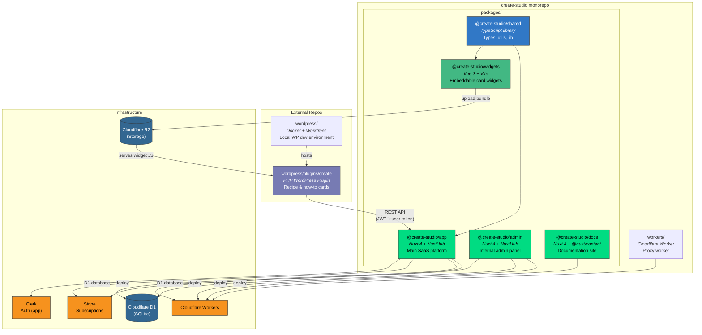

# Monorepo Architecture

## Package Summary

| Package | Framework | Deploy Target | Purpose |
|---------|-----------|---------------|---------|
| `@create-studio/shared` | TypeScript | npm (local) | Shared types, utils, lib code |
| `@create-studio/app` | Nuxt 4 + NuxtHub | Cloudflare Workers + D1 | Main SaaS platform (API + UI) |
| `@create-studio/widgets` | Vue 3 + Vite | Cloudflare R2 (CDN) | Embeddable interactive cards |
| `@create-studio/admin` | Nuxt 4 + NuxtHub | Cloudflare Workers + D1 | Internal admin panel |
| `@create-studio/docs` | Nuxt 4 + Content | Cloudflare Workers | Documentation site |

## External Repos

| Repo | Stack | Deploy Target | Purpose |
|------|-------|---------------|---------|
| `wordpress/plugins/create` | PHP / React / Preact | WordPress.org | WP plugin for recipe/how-to cards |
| `wordpress/` | Docker Compose | Local only | WP dev environment with worktrees |

## Key Data Flows

1. **Publisher creates card** &rarr; WP Plugin &rarr; REST API &rarr; `app` (Cloudflare D1)
2. **Card renders on site** &rarr; WP Plugin injects HTML &rarr; `widgets` JS loaded from R2/CDN
3. **Subscriptions** &rarr; `app` &harr; Stripe webhooks
4. **Auth** &rarr; `app` uses Clerk; WP Plugin uses JWT + per-user token verification flow
5. **Nutrition/scraper** &rarr; WP Plugin &rarr; `app` API endpoints
