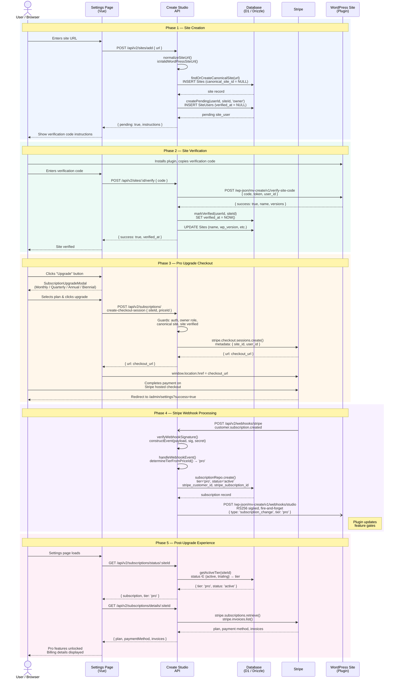

# Subscription Flow: Site Creation to Pro Upgrade

## Summary

This diagram traces the complete lifecycle from a publisher adding their WordPress site to Create Studio through upgrading to the Pro ("Create Unlocked") subscription tier. The flow spans five phases: site creation with canonical site modeling, WordPress plugin verification as a billing prerequisite, Stripe Checkout session initiation with metadata linking, asynchronous webhook processing that updates both the local database and the WordPress site, and the post-upgrade settings experience.

## Key Details

### Participants

| Participant | Technology | Role |
|---|---|---|
| User / Browser | — | Publisher interacting with the app |
| Settings Page | Vue 3 / Nuxt 4 | `pages/admin/settings.vue` + `SubscriptionUpgradeModal.vue` |
| Create Studio API | Nitro (Nuxt server) | `server/api/v2/` route handlers + `server/utils/stripe.ts` |
| Database | Cloudflare D1 / Drizzle ORM | `Sites`, `SiteUsers`, `Subscriptions` tables |
| Stripe | Stripe API | Checkout Sessions, Subscriptions, Billing Portal, Webhooks |
| WordPress Site | WP REST API + Create Plugin | Verification endpoint + webhook receiver |

### Database Tables Involved

| Table | Key Fields | Phase |
|---|---|---|
| `Sites` | `id`, `url`, `canonical_site_id` (NULL = canonical) | 1, 2 |
| `SiteUsers` | `user_id`, `site_id`, `verified_at`, `role`, `user_token` | 1, 2 |
| `Subscriptions` | `site_id`, `tier`, `status`, `stripe_customer_id`, `stripe_subscription_id` | 4, 5 |

### Billing Plans

| Plan | Price | Savings |
|---|---|---|
| Monthly | $15/mo | — |
| Quarterly | $40/quarter | ~$20/yr |
| Annual | $150/yr (default) | $30/yr |
| Biennial | $275/2yr | Best value |

### Checkout Guards (Phase 3)

All four must pass before a Stripe Checkout session is created:

1. User must be authenticated (Clerk session)
2. User must have `owner` role on the site
3. Site must be a canonical site (`canonical_site_id = NULL`)
4. Site must be verified (`verified_at IS NOT NULL`)

### Tier Resolution Logic

- `determineTierFromPriceId()` — all Stripe price IDs map to `'pro'`
- `getActiveTier()` — returns the subscription tier only when `status` is `active` or `trialing`; otherwise returns `'free'`
- The `free-plus` tier exists in the schema but is only assignable via admin tools, not through Stripe

### WordPress Webhook Security

- Signed with RS256 private key
- `X-Studio-Signature` header contains base64-encoded signature
- `X-Studio-Timestamp` header for replay protection
- Public key available at `GET /api/v2/webhooks/public-key`
- Fire-and-forget: failures are logged but never block the Stripe webhook response
