# Migration Guide: Create Plugin v1 to v2

This guide covers the migration paths for upgrading from Create Plugin v1.9.16 to v2.0, including the API authentication changes and new subscription system.

## Overview

Create Plugin v2.0 introduces significant changes to authentication and site management:

- **API v1** → **API v2** with proper authentication
- **Simple JWT tokens** → **Password-based authentication**
- **Multiple site records per URL** → **Canonical site records with multi-user support**
- **No subscriptions** → **Subscription-based access via Create Studio**

## Migration Scenarios

There are two primary migration scenarios:

1. **Existing Users**: Upgrading from Create v1.9.16 to v2.0
2. **New Users**: Fresh installation of Create v2.0

---

## Scenario 1: Existing User Migration (v1.9.16 → v2.0)

### Current State (v1.9.16)


**Key characteristics of v1:**
- Email-only registration (no password)
- Simple JWT token with `user_id` and `site_id`
- Many-to-many relationship: multiple `sites` records per URL, multiple users per site
- Used for nutrition calculation and web scraping endpoints

### Migration Flow

```mermaid
sequenceDiagram
    actor User
    participant Plugin as Create Plugin v1.9.16
    participant PluginV2 as Create Plugin v2.0
    participant APIv1 as API v1
    participant APIv2 as API v2
    participant Studio as Create Studio
    participant Email as Email Service

    Note over User,Email: User upgrades plugin
    User->>Plugin: Currently using v1.9.16
    Plugin->>APIv1: ✓ Authenticated with simple JWT

    User->>PluginV2: Upgrades to v2.0
    PluginV2->>APIv2: Attempts to use v2 routes
    APIv2-->>PluginV2: ❌ Authentication failed

    Note over PluginV2: Shows migration prompt
    PluginV2->>User: "Create Studio requires password authentication"
    PluginV2->>User: Button: "Send Password Reset Email"

    Note over User,Email: User initiates password setup
    User->>PluginV2: Clicks "Send Password Reset"
    PluginV2->>Studio: POST /api/auth/send-reset
    Studio->>Email: Send reset email with token
    Email->>User: Password reset email

    User->>Email: Clicks reset link
    Email->>Studio: Opens reset page with token
    Studio->>User: Password creation form
    User->>Studio: Sets new password

    Note over Studio: Updates user record & creates site_users entry
    Studio->>Studio: Update users.password
    Studio->>Studio: Create site_users record

    Studio-->>User: ✓ Password set successfully

    Note over User,APIv2: Plugin can now authenticate
    User->>PluginV2: Returns to plugin
    PluginV2->>Studio: Login with email + password
    Studio-->>PluginV2: JWT with proper auth

    PluginV2->>APIv2: Requests with new JWT
    APIv2-->>PluginV2: ✓ Authorized

    Note over PluginV2: Nutrition, scraping, etc. work again
```



### Database Changes


**Migration steps for database:**
1. User sets password → `users.password` updated
2. Find or create canonical `sites` record for the URL
3. Create `site_users` record linking user to canonical site
4. Plugin authenticates with email + password
5. API v2 validates via `site_users` table

### User Experience Timeline

```mermaid
gantt
    title Migration Timeline for Existing User
    dateFormat X
    axisFormat %s

    section Before Migration
    Using Create v1.9.16           :0, 1
    API v1 works normally          :0, 1

    section Plugin Update
    Install Create v2.0            :1, 2

    section Broken State
    API calls fail                 :2, 3
    Cannot use nutrition/scraping  :2, 3
    See migration prompt           :2, 3

    section Password Setup
    Click "Send Reset Email"       :3, 4
    Receive email                  :4, 5
    Set password in Studio         :5, 6

    section Restored
    Plugin authenticates           :6, 7
    API v2 works                   :7, 8
    All features restored          :7, 8
```

---

## Scenario 2: New User Installation (v2.0 Fresh Install)

### Installation Flow


### Database Creation for New Users


---

## API Comparison: v1 vs v2

### Authentication Differences


### Endpoint Migration

| Feature | API v1 Endpoint | API v2 Endpoint | Auth Required |
|---------|----------------|-----------------|---------------|
| Registration | `POST /api/v1/register` | `POST /api/auth/register` | Password |
| Login | Auto (email only) | `POST /api/auth/login` | Email + Password |
| Nutrition Calc | `POST /api/v1/nutrition` | `POST /api/v2/nutrition` | JWT (v2) |
| Web Scraping | `POST /api/v1/scrape` | `POST /api/v2/scrape` | JWT (v2) |
| Password Reset | N/A | `POST /api/auth/send-reset` | None |
| Password Reset Confirm | N/A | `POST /api/auth/reset-password` | Reset Token |

---

## System Architecture Overview


---

## Migration Checklist

### For Existing Users (v1.9.16 → v2.0)

- [ ] Install Create Plugin v2.0
- [ ] See migration prompt in plugin
- [ ] Click "Send Password Reset Email"
- [ ] Check email for reset link
- [ ] Click reset link to open Create Studio
- [ ] Set a secure password
- [ ] Return to WordPress plugin
- [ ] Verify API features work (nutrition, scraping)
- [ ] Consider upgrading to paid subscription for additional features

### For New Users (v2.0 Fresh Install)

- [ ] Install Create Plugin v2.0
- [ ] Choose registration method (Studio or Plugin)
- [ ] Complete registration with email + password
- [ ] Verify successful login
- [ ] Test API features
- [ ] Explore Create Studio web application
- [ ] Review subscription options

---

## Troubleshooting

### "Authentication Failed" after upgrading to v2.0

**Problem**: Plugin cannot connect to API v2
**Solution**: Follow the password setup flow by clicking "Send Password Reset Email"

### "Email not found" when requesting password reset

**Problem**: Email address not in system
**Solution**: Ensure you're using the same email as v1.9.16. Contact support if needed.

### Multiple sites using the same URL

**Problem**: Have multiple `sites` records from v1
**Solution**: Migration creates a canonical site record. All users will be linked to this canonical record via `site_users` table.

### Lost access to nutrition/scraping features

**Problem**: API calls failing after upgrade
**Solution**: Complete password setup process. Features will be restored once authenticated with API v2.

---

## Support

If you encounter issues during migration:

1. Check the [Troubleshooting](#troubleshooting) section above
2. Review the [API Documentation](/docs/api-reference)
3. Contact support at support@createstudio.com
4. Visit our community forum at community.createstudio.com

---

## Next Steps

- [API v2 Reference](/docs/api-reference) - Detailed API documentation
- [Subscription Plans](/docs/subscriptions) - Learn about subscription options
- [Create Studio Guide](/docs/studio-guide) - Using the web application
